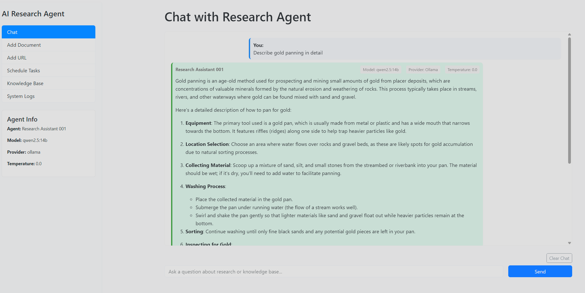
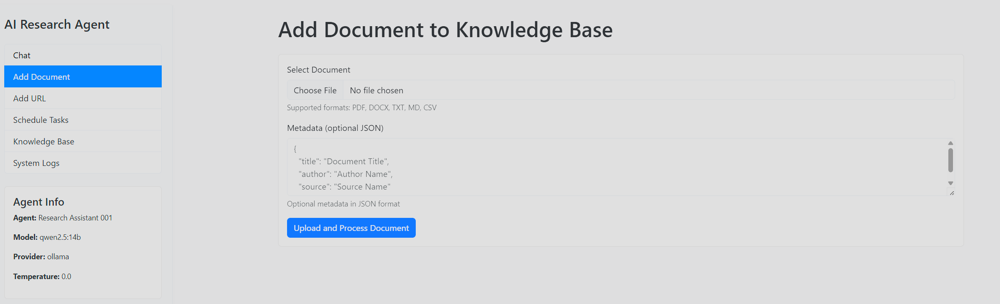
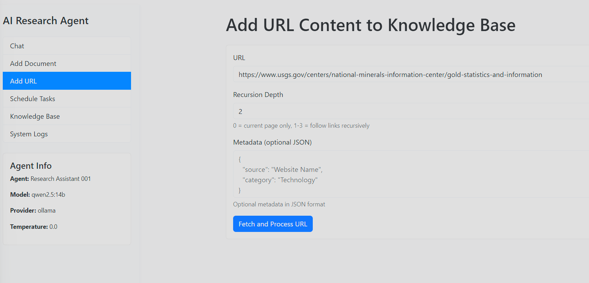
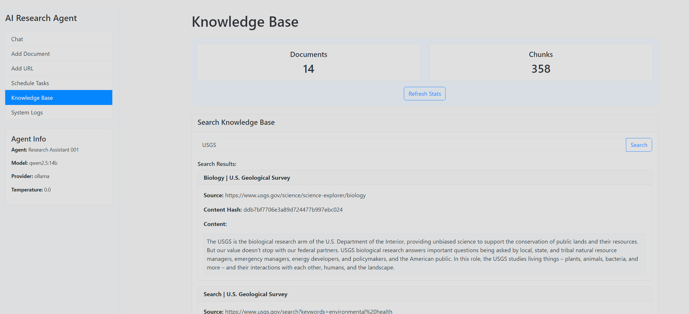
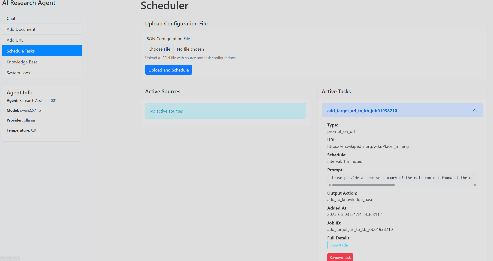
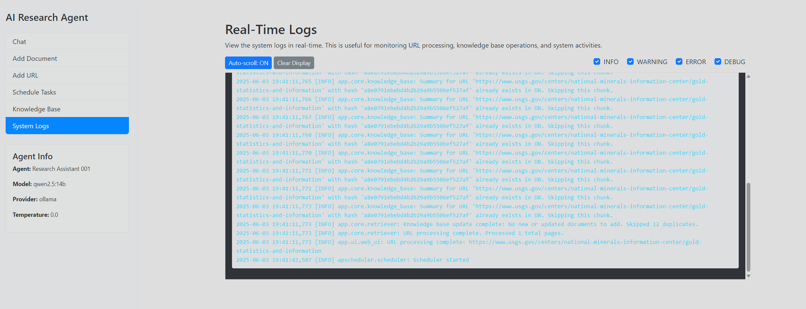

# AI Research Agent

A customizable AI agent that can be trained on documents to become an expert on specific topics for research. The agent can also be scheduled to periodically check specific sources (like websites or arXiv) for new information.

- Supports offline (ollama models, embedding models)
- Supports OpenAI + ollama embeds

## Features

- **Document Training**: Train the agent on various document types (PDF, DOCX, TXT, MD, CSV)
- **URL Content Learning**: Learn from web content, including recursive crawling
- **arXiv Integration**: Automatically fetch and learn from new arXiv papers
- **Scheduled Learning**: Set up periodic checks of sources for continuous learning
- **Knowledge Retrieval**: Query the agent for information it has learned
- **RESTful API**: Interact with the agent through a comprehensive API
- **Command-Line Interface**: Use the agent directly from the terminal
- **Web Interface**: User-friendly Streamlit web UI for interacting with the agent
- **Vector Database Storage**: Efficient storage and retrieval of knowledge
- **Robust Knowledge Base Deduplication**: Prevents duplicate entries and intelligently updates existing content based on URL and content changes (using URL as ID and summary content hash).
- **LLM Temperature Setting for Determinism**: Set the LLM temperature to 0.0 for deterministic outputs, ensuring consistent content hashing and deduplication.
- **Improved Scheduled Task Handling for Knowledge Base Additions**: Automatically handles deduplication for scheduled tasks, ensuring the knowledge base remains up-to-date without redundant entries.

## Feature Screenshots

### Chat



### Add Document



### Add URL Content



#### Recursive URL Crawling Options

When setting a recursion depth greater than 0, the following safety limits apply:

- **Max URLs to Crawl** (default: 100): Maximum total number of URLs to process across all pages
- **Max URLs Per Page** (default: 50): Maximum number of links to follow from any single page

These limits help prevent excessive crawling and can be configured in three ways (in order of precedence):

1. **Per Request**: Set through the web UI when adding URL content
2. **Globally**: Configure in your `.env` file using the variables:
   ```
   MAX_CRAWL_URLS=100       # Maximum total URLs
   MAX_CRAWL_URLS_PER_PAGE=50  # Maximum links per page
   ```
3. **Defaults**: If not specified in the UI or environment, defaults to 100 and 50 respectively

### Knowledge Base Search



### Scheduled Tasks



### System Logs



## Installation

1. Clone this repository:
```bash
git clone https://github.com/yourusername/ai-research-agent.git
cd ai-research-agent
```

2. Install dependencies:
```bash
pip install -r requirements.txt
```

3. Copy the example .env file and configure it:
```bash
cp .env.example .env
```

4. Edit `.env` with your API keys (e.g., OpenAI) and other configuration options. Key settings include:
    - `LLM_PROVIDER`: (e.g., `ollama`, `openai`)
    - `MODEL_NAME` or `OLLAMA_MODEL_NAME`: Specify the LLM model.
    - `OLLAMA_BASE_URL`: If using Ollama.
    - `TEMPERATURE`: Set to `0.0` for deterministic LLM outputs (recommended for consistent content hashing and deduplication), or higher for more creative responses.
    - `LANGCHAIN_API_KEY`, `LANGCHAIN_PROJECT`: For LangSmith tracing (optional).

## Usage

### Web UI Usage

The AI Research Agent includes a user-friendly web interface built with FastAPI and HTML templates:

```bash
python -m app.main web --port 8000 --reload
```

Once started, access the UI by opening `http://localhost:8000` in your browser.

Additional options:
- `--host`: Host address to bind to (default: "0.0.0.0")
- `--port`: Port to run the server on (default: 8000)
- `--reload`: Enable auto-reload on code changes
- `--log-level`: Log level for the server (default: "info")

The web interface provides access to all core agent features:

- **Chat**: Interact with the agent and query the knowledge base using a chat interface
- **Add Document**: Upload and process local documents (PDF, DOCX, TXT, MD, CSV)
- **Add URL**: Fetch and process content from web URLs
- **Schedule Tasks**: Upload configuration files to schedule tasks, and view active sources and tasks
- **Knowledge Base**: View statistics about the knowledge base and search for content

**Note on Temperature Setting**: For the web UIs and scheduled tasks, remember that setting the LLM temperature to 0.0 (in your `.env` file) is critical for deterministic outputs. This ensures consistent content hashing and reliable deduplication in the knowledge base.

### Command Line Interface

The agent can be used through the command line interface for various operations:

```bash
# Query the agent
python -m app.main query "What are the latest developments in transformer models?"

# Schedule sources from a configuration file
python -m app.main schedule sample_config.json

# Start the API server
python -m app.main api --port 8000

# Start the Web UI
python -m app.main web --port 8501
```

### Adding Information to the Knowledge Base

You can add information to the agent's knowledge base from local files or URLs.

#### Document Processing Flow

```
                                                 +---------------------+
                                                 |                     |
                                                 |  Knowledge Base     |
                                                 |  (ChromaDB)         |
                                                 |                     |
                                                 +---------------------+
                                                    ^         ^
                                                    |         |
                                                    |         |
                                                    |         |
+--------------------+   +--------------------+   +--------------------+
|                    |   |                    |   |                    |
| Document Upload    |-->| DocumentRetriever  |-->| Text Splitter     |
| (PDF, TXT, MD, etc)|   | (Loads & Processes)|   | (Chunk & Process) |
|                    |   |                    |   |                    |
+--------------------+   +--------------------+   +--------------------+
                               |
                               |
                               v
+--------------------+   +--------------------+
|                    |   |                    |
| URL Processing     |-->| Web Content        |
| (URL + max_depth)  |   | Extraction         |
|                    |   |                    |
+--------------------+   +---------+----------+
                                  |
                                  | (If recursion enabled)
                                  v
                         +--------------------+
                         |                    |
                         | Link Extraction    |
                         | (Follow links up   |
                         |  to max_depth)     |
                         |                    |
                         +--------------------+
```

The document processing pipeline uses these key steps:

1. **Input Sources**:
   - Document Upload: Local files (PDF, DOCX, TXT, MD, CSV) processed by specific loaders
   - URL Processing: Web content fetched using WebBaseLoader or RecursiveURLLoader with max_depth

2. **Processing Pipeline**:
   - DocumentRetriever loads content based on its type 
   - Content is split into chunks using RecursiveCharacterTextSplitter (chunks ~1000 chars, overlap 200 chars)
   - Each chunk gets metadata including document_id, content_hash, source information, and timestamp

3. **Storage (KnowledgeBase)**:
   - ChromaDB vector store for persistent storage in ./knowledge_base directory
   - Deduplication using document_id and content_hash
   - Old chunks for a document are deleted when updated versions are added

The agent provides multiple ways to add content to the knowledge base: from local files or URLs.

#### Using the `add_docs.sh` script (Recommended for local files)

A convenience script `add_docs.sh` is provided in the project root to simplify adding local documents (single files or entire directories).

1.  **Activate the virtual environment** (if not already active):
    ```bash
    source venv/bin/activate
    ```
2.  **Run the script** from the project root (`/home/anelson/ai-research-agent/`):
    *   To add a single file:
        ```bash
        ./add_docs.sh /path/to/your/document.pdf
        ```
    *   To add all supported documents (PDF, DOCX, TXT, MD, CSV) in a directory (recursively):
        ```bash
        ./add_docs.sh /path/to/your/documents_folder/
        ```

#### Manually Adding a Local Document

To add a single local document (PDF, TXT, MD, DOCX, CSV) to the knowledge base using the direct command:

```bash
python -m app.main add-document /path/to/your/document.ext --metadata '{"source": "manual upload", "topic": "general"}'
```
*(Note: The `--metadata` flag is optional but recommended for better organization.)*

#### Manually Adding Content from a URL

To add content from a specific URL:

```bash
python -m app.main add-url https://example.com/article --depth 1 --metadata '{"source": "website", "topic": "specific article"}'
```
*   `--depth`: Specifies the recursion depth for linked pages (optional, default is 0, which means no recursion).
*   `--max-urls`: Maximum number of total URLs to crawl (optional, default is 100).
*   `--max-urls-per-page`: Maximum number of links to follow from each page (optional, default is 50).
*   `--metadata`: Optional JSON string for metadata.

### API Usage

Start the API server:

```bash
python -m app.main api
```

The API will be available at `http://localhost:8000`. Key endpoints:

- `POST /query`: Query the agent
- `POST /learn/document`: Upload and learn from a document
- `POST /learn/url`: Learn from a URL
- `POST /learn/text`: Learn from text input
- `POST /sources`: Add a source for scheduled checking
- `GET /sources`: List all scheduled sources
- `DELETE /sources/{source_id}`: Remove a scheduled source
- `GET /kb/stats`: Get knowledge base statistics

### Scheduling Sources

Create a JSON configuration file (see `sample_config.json`) to schedule sources:

```json
{
  "sources": [
    {
      "source_id": "arxiv_ai_research",
      "source_type": "arxiv",
      "search_query": "artificial intelligence",
      "categories": ["cs.AI", "cs.CL"],
      "interval_hours": 24
    },
    {
      "source_id": "tech_blog",
      "source_type": "url",
      "url": "https://example.com/blog",
      "interval_minutes": 1440,
      "max_depth": 1
    }
  ]
}
```

The configuration file can also define **Scheduled Tasks**, which allow you to periodically execute a specific prompt against content fetched from a URL and then perform an action with the agent's output.

For two uploadable examples see `example_schedule_config-addToKnowledgeBase.json` and `example_schedule_config-logToFile.json`.

Add a `scheduled_tasks` array to your JSON configuration. Each object in this array defines a task:

```json
{
  "sources": [
    /* Your existing sources for populating the knowledge base would go here */
  ],
  "scheduled_tasks": [
    {
      "task_id": "unique_task_identifier",
      "task_type": "prompt_on_url",
      "url": "https://target-url.com/page_to_analyze",
      "prompt_template": "Based on the content from {url}, please summarize the key points. URL Content: {url_content}",
      "interval_minutes": 1440,
      "output_action": {
        "type": "log_to_file",
        "filepath": "./task_outputs/my_task_log.txt"
      },
      "metadata": {
        "description": "Daily analysis of target-url.com."
      }
    }
  ]
}
```

Notes about the configuration:
- For scheduling, use either `interval_minutes` or `cron_expression` (e.g., "0 9 * * *" for daily at 9 AM)
- For `output_action`, use one of these types:
  - `log_to_file`: Saves output to the specified filepath
  - `add_to_knowledge_base`: Adds the output to your knowledge base with optional `document_title` and `metadata`

**Scheduled Task Parameters:**

*   `task_id` (string, required): A unique identifier for this scheduled task.
*   `task_type` (string, required): Currently, `"prompt_on_url"` is supported.
*   `url` (string, required): The URL from which to fetch content for the prompt.
*   `prompt_template` (string, required): The prompt to be executed by the agent. 
    *   Use `{url}` as a placeholder for the target URL string itself within the prompt if needed.
    *   Use `{url_content}` as a placeholder where the fetched text content from the URL will be injected.
*   Scheduling:
    *   `interval_minutes` (integer): Define the run interval in minutes.
    *   `cron_expression` (string): Alternatively, define the schedule using a cron expression (e.g., `"0 9 * * *"` for daily at 9 AM). If provided, this overrides `interval_minutes`.
*   `output_action` (object, required): Defines what to do with the agent's response to the prompt.
    *   `type` (string, required): Specifies the action type.
        *   `"log_to_file"`: Appends the agent's output to a specified file.
            *   `filepath` (string, required for `log_to_file`): Path to the log file.
        *   `"add_to_knowledge_base"`: Adds the agent's output as a new document to the knowledge base.
            *   `document_title` (string, optional): Title for the new document. Can use `{url}` and `{date}` placeholders.
            *   `metadata` (object, optional): Custom metadata to associate with the new document in the knowledge base.
*   `metadata` (object, optional): General metadata about the scheduled task itself.

**Note on `add_to_knowledge_base` for Scheduled Tasks:** This action now automatically handles deduplication. The system uses the URL as a unique document identifier (`document_id`) and a SHA256 hash of the LLM-generated summary (`content_hash`).
    - If a summary for the same URL with identical content (same hash) already exists, it will be skipped.
    - If the content for a URL changes (different hash), the old summary and its associated chunks will be removed and replaced with the new summary.
    - This ensures the knowledge base remains up-to-date without redundant entries, especially when `TEMPERATURE` is set to `0.0` for deterministic LLM outputs.

Run the scheduler:

```bash
python -m app.main schedule sample_config.json
```

## Agent Prompt Processing Flow

```
+------------------+     +------------------+     +----------------------+
|                  |     |                  |     |                      |
| User Query       |---->| ResearchAgent    |---->| LLM Provider         |
| (Chat/CLI/Config)|     | (Orchestrates)   |     | (Ollama or OpenAI)   |
|                  |     |                  |     |                      |
+------------------+     +--------+---------+     +----------------------+
                                 |                         ^
                                 | (Knowledge needed?)     |
                                 v                         |
                        +------------------+               |
                        |                  |               |
                        | Knowledge Base   |---------------+
                        | Retrieval        |
                        |                  |
                        +------------------+
```

**Prompt Processing Flow Details**:

1. **Input Methods**:
   - Chat UI interface (FastAPI web interface)
   - CLI commands
   - Scheduled tasks via configuration files

2. **Processing Path**:
   - Query goes to ResearchAgent, which determines if knowledge base access is needed
   - If needed, relevant documents are retrieved from ChromaDB vector store
   - LLM selection is based on environment variables:
     - `LLM_PROVIDER`: "ollama" or "openai"
     - If "ollama": Uses `OLLAMA_BASE_URL` and `OLLAMA_MODEL_NAME`
     - If "openai": Uses OpenAI's API with specified API key
     - Temperature control via `TEMPERATURE` env variable (0.0 for deterministic output)

3. **Scheduled Task Processing**:
   - SourceScheduler manages tasks based on schedule configuration
   - Tasks can run custom prompts against fetched URL content and take actions

The AI Research Agent uses a multi-step flow when processing prompts. It supports explicit toggling of the knowledge base via the `use_knowledge_base` parameter:

1.  **Prompt Reception**: Your input prompt is received by the `app/main.py` script (if using CLI) or the `app/api.py` (if using API).
2.  **Agent Initialization**: The `ResearchAgent` (from `app/core/agent.py`) is set up. This involves:
    *   Loading configurations from your `.env` file (e.g., `LLM_PROVIDER`, model names, API keys, `OLLAMA_BASE_URL`, etc.).
    *   Initializing the appropriate Language Model (LLM): `ChatOllama` if `LLM_PROVIDER` is "ollama", or `ChatOpenAI` if "openai".
    *   Initializing the `KnowledgeBase` (from `app/core/knowledge_base.py`). This sets up the embedding model (e.g., `OllamaEmbeddings` with `OLLAMA_EMBEDDING_MODEL_NAME` or `OpenAIEmbeddings`) and connects to the Chroma vector store (defaulting to `./knowledge_base/`).
    *   Preparing available tools. The primary tool is `knowledge_base_search`, which allows the agent to query the vector store for relevant information.
    *   Building the Agent Executor. 
        *   If using Ollama (or other models not supporting OpenAI-style function calling), this is typically a `ReAct` agent created using `create_react_agent` and a prompt template (e.g., from Langchain Hub: `hwchase17/react-chat`).
        *   If using OpenAI, it might be an `OpenAI Tools` agent created using `create_openai_tools_agent`.
3.  **Agent Invocation**: The core `agent_executor.invoke()` method is called with your prompt and any existing chat history.
4.  **Internal Agent Loop (Example: Langchain ReAct Agent with Ollama)**:
    *   **Prompt Templating**: Your input, chat history, available tools (like `knowledge_base_search` with its description), and the ReAct-specific instructions are formatted into a detailed prompt for the LLM.
    *   **LLM Call (Thought/Action Generation)**: The formatted prompt is sent to the configured LLM (e.g., your local Ollama model like `llama3.1:8b` via its API).
    *   The LLM responds with a "Thought" (its reasoning process on how to answer the prompt) and an "Action". The Action specifies which tool to use (e.g., `knowledge_base_search`) and the input for that tool (e.g., `query='your search term derived from the prompt'`). If the LLM believes it can answer directly without a tool, it will output a "Final Answer" instead of an Action.
    *   **Tool Execution**: If the LLM decides to use a tool:
        *   The agent framework parses the LLM's action and executes the specified tool with the given input.
        *   For `knowledge_base_search`:
            1.  The tool's input query is embedded using the configured embedding model (e.g., `OllamaEmbeddings` with `nomic-embed-text`).
            2.  A similarity search is performed against the vectors in the ChromaDB knowledge base.
            3.  The most relevant document chunks are retrieved.
    *   **Observation**: The output from the tool (e.g., the retrieved document chunks) is formatted as an "Observation".
    *   **Iteration**: The Observation is sent back to the LLM along with the original prompt and the history of previous thoughts/actions/observations. The LLM then generates a new Thought. It might decide to:
        *   Use another tool (or the same tool with different input).
        *   Refine its previous action.
        *   Conclude that it has enough information and proceed to a Final Answer.
    *   This cycle of Thought -> Action -> Tool Execution -> Observation -> Thought continues until the LLM believes it can provide a final answer.
5.  **Final Answer Generation**: Once the LLM outputs a "Final Answer" in its response, the agent executor stops the loop.
6.  **Response Delivery**: This final answer is returned by the `agent_executor` and then displayed to you via the CLI or API response.

### Knowledge Base Toggle

The agent supports explicit toggling of the knowledge base retrieval with the `use_knowledge_base` parameter in the `ResearchAgent.run()` method. This allows you to control whether the agent uses the knowledge base or relies solely on the LLM's built-in knowledge.

- When enabled (`use_knowledge_base=True`), the agent queries the knowledge base for relevant context and includes this in the prompt to the LLM.
- When disabled (`use_knowledge_base=False`), the agent sends queries directly to the LLM without retrieving information from the knowledge base.

This toggle is useful for:
- Testing the impact of the knowledge base on response quality
- Isolating built-in model knowledge from specific domain knowledge
- Reducing computational overhead when knowledge base context isn't needed

### Testing Knowledge Base Toggle

A test script is provided to compare agent responses with and without knowledge base enabled:

```bash
python tools/llmAblationTest.py -q "Your test question here"
```

Options:
- `-q/--queries`: One or more queries to test (default: a set of predefined test queries)
- `--no-diff`: Disable showing the differences between responses

The script will run each query twice (with and without knowledge base), time each response, and display the results side-by-side with a word-level difference analysis.

This tool is essential for validating that the knowledge base is working correctly and for understanding how the agent's knowledge from the KB differs from the LLM's built-in knowledge.

## Project Structure

```
ai-research-agent/
├── app/
│   ├── core/
│   │   ├── agent.py         # Core agent implementation
│   │   ├── knowledge_base.py # Vector database integration
│   │   └── retriever.py     # Document loading and retrieval
│   ├── schedulers/
│   │   └── source_scheduler.py # Scheduled source checking
│   ├── ui/
│   │   └── launcher.py      # Web UI launcher
│   ├── api.py               # FastAPI interface
│   └── main.py              # CLI interface
├── knowledge_base/          # Default storage location (Created first time you run the app)
├── tools/                   # Utility scripts
│   └── llmAblationTest.py   # Script to test KB toggle functionality
├── .env.example             # Environment variables template
├── requirements.txt         # Dependencies
├── sample_config.json       # Example source configuration
├── add_docs.sh              # Convenience script for adding local documents
└── README.md                # This file
└── example_schedule_config-toFile.json                # Example schedule configuration to file
└── example_schedule_config-addToKnowledgeBase.json    # Example schedule configuration to add to knowledge base
```

## Customization

### Adding Custom Tools

You can extend the agent with custom tools by modifying the `ResearchAgent` class in `app/core/agent.py`:

```python
from langchain.tools import Tool

# Define a custom tool function
def custom_tool_function(query: str) -> str:
    # Your custom logic here
    return f"Result for {query}"

# Create a tool
custom_tool = Tool(
    name="custom_tool",
    func=custom_tool_function,
    description="Description of what this tool does"
)

# Add the tool to your agent
agent.add_tool(custom_tool)
```

### Custom Source Scheduling

You can create custom source checkers by using the `add_custom_source` method:

```python
def check_custom_source(agent, metadata):
    # Your custom source checking logic
    result = agent.learn_from_url("https://example.com/api/latest")
    return result

scheduler.add_custom_source(
    source_id="custom_api",
    check_function=check_custom_source,
    interval_minutes=60
)
```

## Requirements

- Python 3.8+
- OpenAI API key or Ollama
- Disk space for vector database storage

## License

This project is licensed under the MIT License - see the LICENSE file for details.
